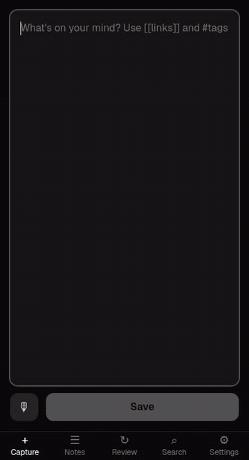
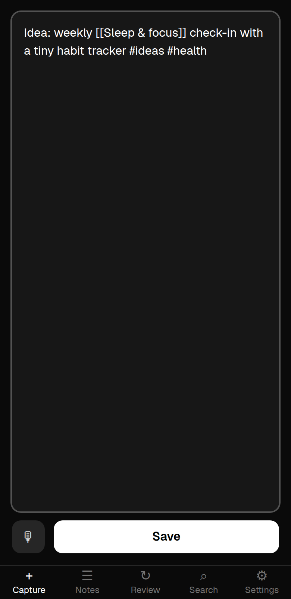
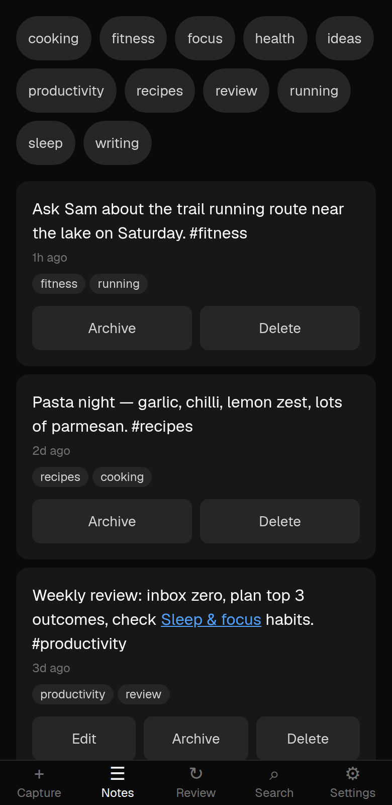
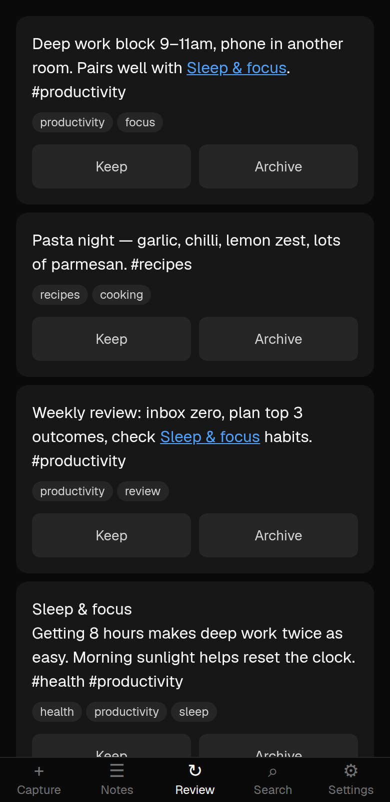
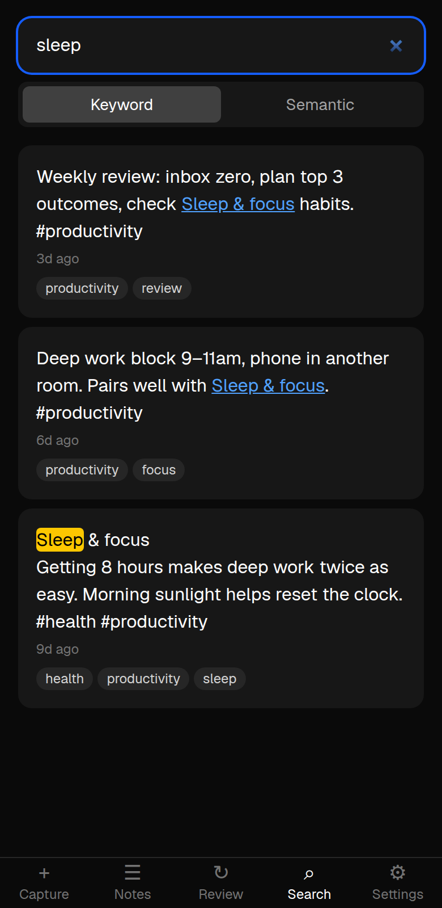
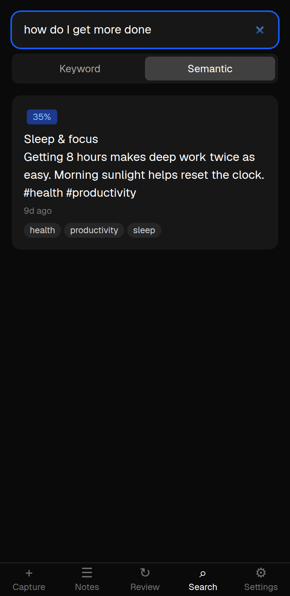
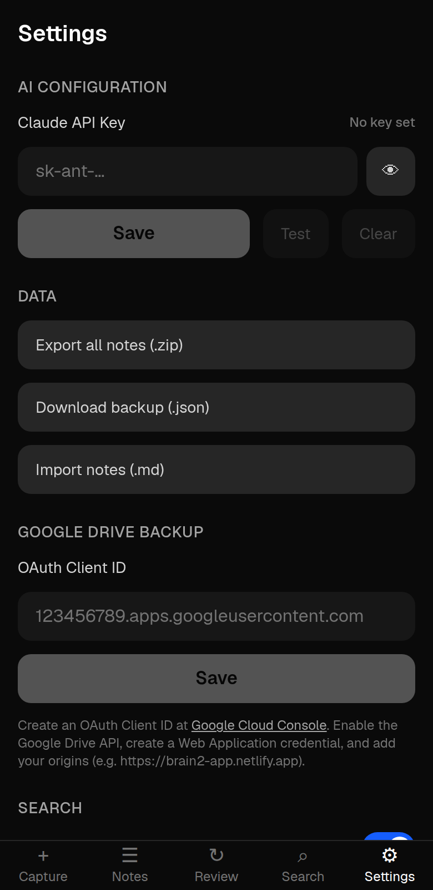
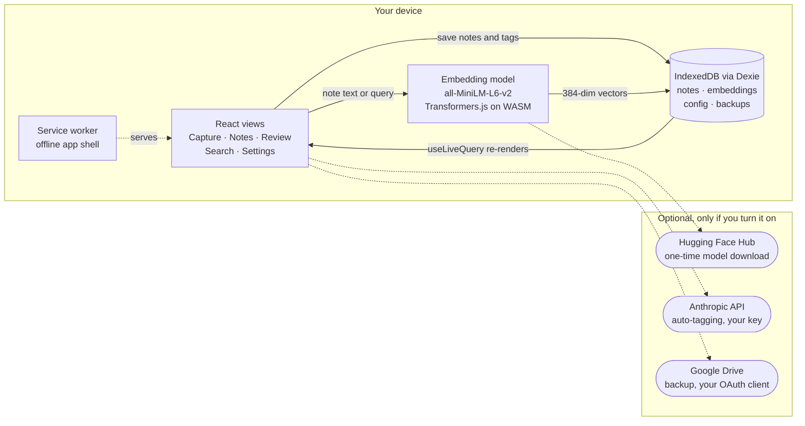
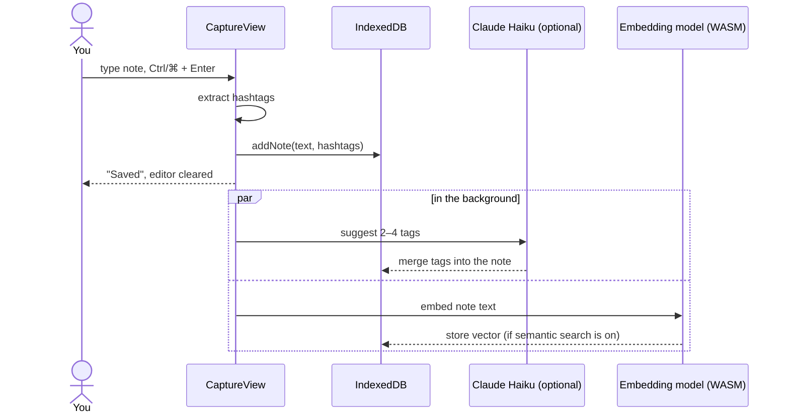

<div align="center">

# 🧠 brain2

**A local-first second brain that lives in your browser.**

Capture a thought in two seconds, link it Obsidian-style, and find it again by _meaning_ —
with a neural search model running entirely on your device.

[**Open the app →**](https://brain2-app.netlify.app)




</div>

---

## Why brain2?

Most note apps make you choose between _fast capture_, _good retrieval_, and _privacy_. brain2 refuses to.

- ⚡ **Capture first, organise later.** The app opens straight into a text box. Type or dictate, hit <kbd>Ctrl</kbd>/<kbd>⌘</kbd>+<kbd>Enter</kbd>, done.
- 🔎 **Search by meaning, not just words.** "how do I get more done" finds your note about _sleep and deep work_ — no shared keywords needed.
- 🔒 **Private by architecture.** Notes, tags and embeddings live in IndexedDB on your device. There's no brain2 server to send them to.
- ✈️ **Works offline.** It's an installable PWA; the app shell and the search model are cached after first use.
- 🗂️ **Not a walled garden.** Plain Markdown with `[[wikilinks]]`, `#tags` and YAML frontmatter. Export a ZIP and drop it into Obsidian.

## Screenshots

<table>
  <tr>
    <td align="center"><br><b>Capture</b><br><sub>Type or dictate; #tags and [[links]] inline</sub></td>
    <td align="center"><br><b>Notes</b><br><sub>Tag filters, wiki-links, edit / archive</sub></td>
    <td align="center"><br><b>Review</b><br><sub>Resurface a few older notes each day</sub></td>
  </tr>
  <tr>
    <td align="center"><br><b>Keyword search</b><br><sub>Instant, highlighted matches</sub></td>
    <td align="center"><br><b>Semantic search</b><br><sub>Meaning-based, scored, fully offline</sub></td>
    <td align="center"><br><b>Settings</b><br><sub>AI key, import/export, Drive backup, theme</sub></td>
  </tr>
</table>

## Features

|     | Feature                       | Details                                                                                                                                                                                                                                                                                            |
| --- | ----------------------------- | -------------------------------------------------------------------------------------------------------------------------------------------------------------------------------------------------------------------------------------------------------------------------------------------------- |
| ✍️  | **Quick capture**             | Autofocused editor, <kbd>Ctrl</kbd>/<kbd>⌘</kbd>+<kbd>Enter</kbd> to save, haptic feedback on mobile.                                                                                                                                                                                              |
| 🎙️  | **Dictation**                 | Voice-to-text via the Web Speech API, continuous until you stop it.                                                                                                                                                                                                                                |
| 🏷️  | **Tags**                      | `#hashtags` in the text become tags automatically; filter the notes list by tapping a tag chip.                                                                                                                                                                                                    |
| 🔗  | **Wiki-links & backlinks**    | `[[Note title]]`, `[[Note\|alias]]` and `[[Note#Heading]]` links. A note's first line is its title, and every note shows what links to it.                                                                                                                                                         |
| 🔍  | **Keyword search**            | Case-insensitive search across all notes (archived ones included, and labelled) with highlighted matches.                                                                                                                                                                                          |
| 🧠  | **Semantic search**           | Opt-in. Runs the [`all-MiniLM-L6-v2`](https://huggingface.co/Xenova/all-MiniLM-L6-v2) sentence-embedding model in the browser via [Transformers.js](https://huggingface.co/docs/transformers.js) + WebAssembly. One download of about 110 MB (90 MB model + 20 MB runtime), then it works offline. |
| 🔁  | **Daily review**              | A random handful (3–15, configurable) of notes older than 24 hours. Keep or archive each one.                                                                                                                                                                                                      |
| 🤖  | **AI auto-tagging**           | Optional. Bring your own Claude API key and each saved note gets 2–4 suggested tags from Claude Haiku. Requests go straight from your browser to Anthropic.                                                                                                                                        |
| 📦  | **Import / export**           | Export every note as Obsidian-friendly `.md` files in a ZIP, or as a JSON backup. Import `.md` files (frontmatter tags in `[a, b]`, `a, b` or YAML list form).                                                                                                                                     |
| ☁️  | **Google Drive backup**       | Optional. One-tap backup/restore of notes _and_ embeddings to a `Brain2/` folder in your Drive (`drive.file` scope only).                                                                                                                                                                          |
| 🛟  | **Automatic local snapshots** | A snapshot of all notes is saved to IndexedDB once a day and kept for 7 days.                                                                                                                                                                                                                      |
| 🎨  | **Make it yours**             | Dark / light / system theme, three note font sizes.                                                                                                                                                                                                                                                |

## How it works

brain2 is a statically exported Next.js app. There's no backend: every view reads and writes IndexedDB through [Dexie](https://dexie.org), and `useLiveQuery` keeps the UI in sync with the database as it changes.



### Saving a note

Saving is instant: the note is written once, then tagging and embedding happen in the background so the editor is ready for the next thought immediately.



### Semantic search

1. The first time you switch to **Semantic**, the MiniLM model is downloaded and cached, then any notes without a vector are embedded.
2. Your query is embedded with the same model (mean-pooled and normalised, so a dot product is the cosine similarity).
3. Every note vector is scored. Results with a similarity of at least 0.3 are shown, up to 10, best first. The results refresh as background embeddings arrive.

At personal-notes scale (thousands of notes) a brute-force scan over the vectors takes a few milliseconds, so no vector index is needed.

### Data model

| Table        | Key                         | Contents                                            |
| ------------ | --------------------------- | --------------------------------------------------- |
| `notes`      | `++id`                      | `text`, `tags[]`, `createdAt`, `archived`           |
| `embeddings` | `++id`, indexed by `noteId` | `vector: number[]` (384 floats)                     |
| `config`     | `key`                       | Settings: theme, font size, API key, feature flags… |
| `backups`    | `++id`                      | Daily snapshots of all notes, pruned after 7 days   |

## Obsidian compatibility

Exported notes are plain Markdown files named `YYYY-MM-DD-slug.md`:

```markdown
---
date: 2026-09-26
tags: ['health', 'productivity', 'sleep']
---

Sleep & focus
Getting 8 hours makes deep work twice as easy. See [[Deep work]]. #health
```

Unzip the export into a vault and your links, tags and dates carry over. Going the other way, import `.md` files from Settings → **Import notes**. Frontmatter `date` and `tags` are read, inline `#tags` are merged in, and notes whose text already exists are skipped.

## Getting started

**Requirements:** Node.js 20+

```bash
git clone https://github.com/ChrisBrooksbank/brain2.git
cd brain2
npm install
npm run dev
```

Open <http://localhost:3000>. The service worker is disabled in development; run `npm run build` and serve the `out/` directory to try the offline PWA.

### Optional setup

<details>
<summary><b>🤖 AI auto-tagging (Claude)</b></summary>

1. Create an API key at [console.anthropic.com](https://console.anthropic.com).
2. In brain2, go to **Settings → AI Configuration**, paste the key, then tap **Save** and **Test**.

The key is stored only in your browser's IndexedDB and sent only to `api.anthropic.com`. Each saved or edited note costs one small Claude Haiku request.

</details>

<details>
<summary><b>☁️ Google Drive backup</b></summary>

1. In [Google Cloud Console](https://console.cloud.google.com/apis/credentials), create an **OAuth 2.0 Client ID** (type: _Web application_) and add your brain2 origin (e.g. `https://brain2-app.netlify.app` or `http://localhost:3000`) under **Authorized JavaScript origins**.
2. Enable the **Google Drive API** for the project.
3. In brain2, go to **Settings → Google Drive**, paste the Client ID, then **Connect**.

brain2 asks only for the `drive.file` scope, so it can see the files it creates and nothing else. Backups go to `Brain2/brain2-backup.json`. Restores merge into your existing notes and skip duplicates.

</details>

<details>
<summary><b>🧠 Semantic search</b></summary>

Turn it on in **Settings → Search**. The model (about 110 MB including the WASM runtime) downloads on first use and is cached for offline use. You can **Regenerate search index** or **Clear model cache** from the same section.

</details>

## Scripts

| Command                              | What it does                                                             |
| ------------------------------------ | ------------------------------------------------------------------------ |
| `npm run dev`                        | Start the Next.js dev server                                             |
| `npm run build`                      | Production build (static export to `out/`, generates the service worker) |
| `npm run check`                      | Typecheck + lint + unit tests                                            |
| `npm run test`                       | Vitest in watch mode                                                     |
| `npm run test:e2e`                   | Playwright end-to-end tests                                              |
| `npm run lint` / `npm run typecheck` | ESLint / `tsc --noEmit`                                                  |
| `npm run format`                     | Prettier                                                                 |
| `npm run knip`                       | Find unused files, exports and dependencies                              |

CI (GitHub Actions) runs typecheck, lint, format check, knip, unit tests, `npm audit` and the Playwright suite on every pull request.

## Project structure

```
app/            Next.js App Router pages (/, /notes, /review, /search, /settings) and the service worker
components/     React views and UI pieces, with co-located *.test.tsx
hooks/          useConfigValue: live-updating settings from IndexedDB
lib/            Core logic: Dexie DB, embeddings, search, AI tagging, import/export, Drive sync
types/          Ambient type declarations (Web Speech API)
e2e/            Playwright tests (interaction, visual, voice)
specs/          Feature specifications used to drive development
docs/images/    README screenshots and demo GIF
```

## Tech stack

- **[Next.js](https://nextjs.org) + React 19 + TypeScript**: static export, App Router
- **[Transformers.js](https://huggingface.co/docs/transformers.js)**: in-browser neural embeddings via ONNX Runtime Web (WASM)
- **[Dexie](https://dexie.org)**: IndexedDB with live queries
- **[Serwist](https://serwist.pages.dev)**: service worker / offline PWA
- **Tailwind CSS v4**: styling
- **Vitest + Testing Library + Playwright**: unit, component and end-to-end tests
- **ESLint, Prettier, Husky, lint-staged, Knip**: guard rails
- **Netlify**: hosting

## How it was built

brain2 was developed with an autonomous "Ralph Wiggum" loop: an AI agent repeatedly picks the next task from `IMPLEMENTATION_PLAN.md`, implements it against the specs in `specs/`, and validates it with the test suite. See [`AGENTS.md`](AGENTS.md), [`PROMPT_build.md`](PROMPT_build.md) and [`loop.sh`](loop.sh) for the details.

## License

[MIT](LICENSE)
